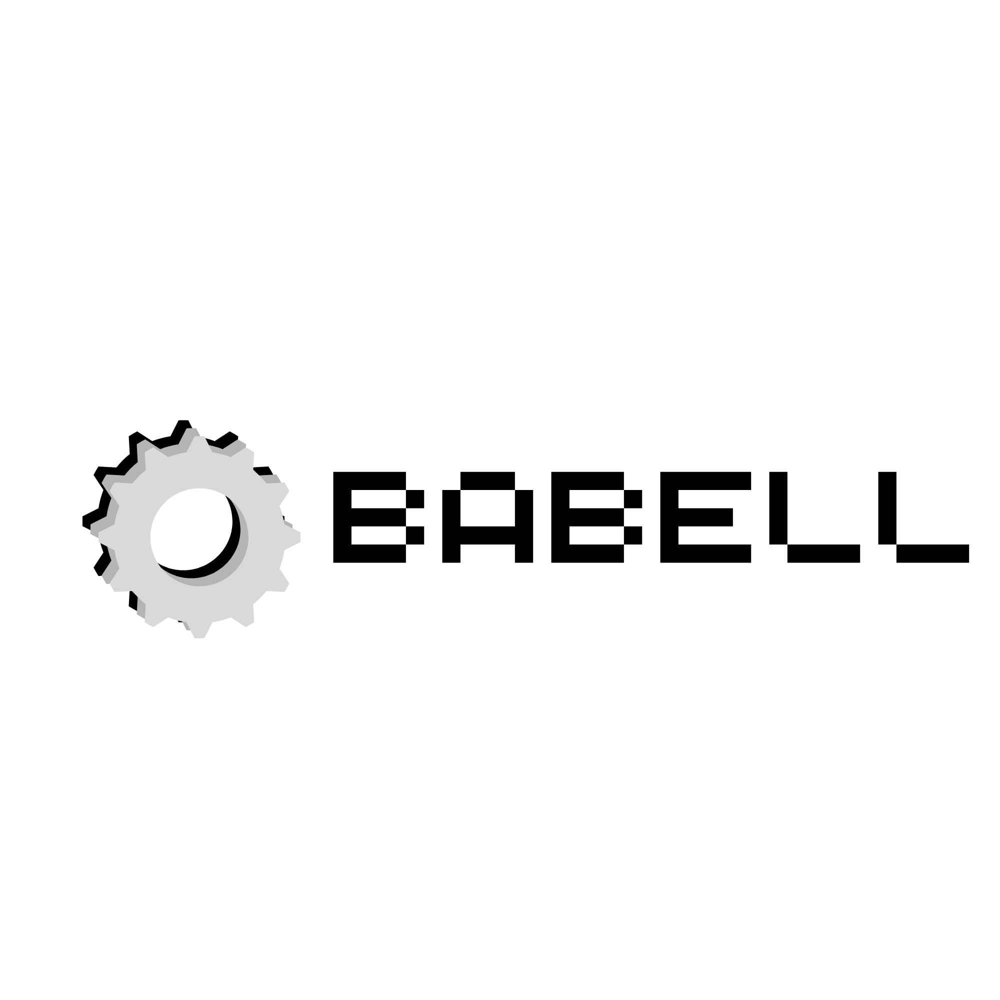

# Babell

<div align="center">
  
</div>

A modern, intelligent terminal that understands natural language commands and converts them to system commands. Enhanced with comprehensive programming and development features.

## Enhanced Programming Features

**Git Operations**: "git status", "git add all", "git commit with message 'fix'"
**Package Management**: "npm install express", "pip install requests"  
**Project Creation**: "create react app myproject", "create python file main"
**Docker Support**: "docker build myapp", "docker run container"
**Code Execution**: "run python file script.py", "run node file app.js"
**File Templates**: "create html file index", "create css file styles"
**Build Tools**: "build for production", "run dev server"
**Smart Workspace Navigation**: Intelligent folder finding and project detection
- "work in folder MyReactApp" → Finds and navigates to MyReactApp folder anywhere on system  
- "show my projects" → Lists all detected programming projects
- "find folder NodeJS" → Searches and shows all matching folders
- Auto-detects projects by looking for package.json, .git, requirements.txt, etc.

## Features

**Natural Language Processing**: Type commands in plain English
- "create a file called notes.txt" → `touch "notes.txt"`
- "go to Documents folder" → `cd "Documents"`
- "list all files" → `dir`
- "copy file.txt to backup.txt" → `copy "file.txt" "backup.txt"`

**Modern GUI Interface**: Dark theme with syntax highlighting
- Clean, professional interface
- Color-coded output (success, error, warnings)
- Command history with up/down arrows
- Real-time directory tracking

**Safety Features**: Built-in command validation
- Dangerous command detection
- Confirmation for risky operations
- Safe command execution environment

**Smart Suggestions**: Helpful hints and alternatives
- Auto-complete suggestions
- Command confidence scoring
- Alternative command recommendations

## Supported Natural Language Commands

### File Operations
- Create files: "create a file called example.txt"
- Create folders: "make a new folder named MyFolder"
- Delete files: "delete the file old.txt"
- Copy files: "copy important.doc to backup.doc"
- Move files: "move file.txt to Documents"
- Rename files: "rename old.txt to new.txt"

### Programming & Development Operations
- **Git**: "git status", "git add all", "git commit with message 'update'"
- **NPM**: "npm install express", "npm run build", "npm test"
- **Python**: "run python file main.py", "pip install requests", "activate python venv"
- **Docker**: "docker build myapp", "docker run container", "docker list containers"
- **Project Creation**: "create react app myproject", "create python file main"
- **Code Templates**: "create html file index", "create css file styles"
- **Build & Development**: "build for production", "run dev server"
- **IDE Integration**: "open in vscode app.js"

### Navigation & Workspace Management
- Change directory: "go to Documents", "navigate to Desktop"
- **Smart Folder Finding**: "find folder MyProject", "work in folder ReactApp"
- **Project Detection**: "show my projects", "list my workspaces"  
- **Auto-Navigation**: "find and work in NodeProject" (auto-finds and navigates)
- Go up: "go back", "up one level"
- Go home: "go home"

### Viewing & Listing
- List files: "list all files", "show contents"
- View file content: "show the content of README.md"
- Find files: "search for *.txt"

### System Operations
- Show directory: "show current directory"
- Show date/time: "display current time"
- Clear screen: "clear the screen"
- Show processes: "list running programs"

### Network Operations
- Ping: "ping google.com"
- Network info: "show network connections"
- IP config: "display IP configuration"

## Installation & Usage

### Requirements
- Python 3.7+
- Windows OS (designed for Windows terminal commands)
- Tkinter (usually included with Python)

### Running the Terminal

#### 🎯 **Recommended Methods (Easiest):**
```powershell
# Double-click any of these files:
launch_babell.py         # Enhanced Python launcher (recommended)
launch_babell.bat        # Enhanced Windows launcher with graphics
```

#### ⚙️ **Alternative Methods:**
```powershell
python main.py           # Standard method
python launch_babell.py  # Enhanced launcher from command line
scripts\run_terminal.bat # Original batch script
```

#### 💡 **Troubleshooting:**
- If double-clicking `.py` files opens a text editor instead of running Python, use the `.bat` files
- Make sure Python is installed and added to your system PATH
- The enhanced launchers provide better error messages and stay open for debugging

## Project Structure

```
Babell/
├── main.py                     # Main entry point
├── README.md                   # This file
├── requirements.txt            # Dependencies
├── .gitignore                 # Git ignore rules
├── src/                       # Source code
│   ├── __init__.py
│   ├── core/                  # Core functionality
│   │   ├── __init__.py
│   │   ├── natural_language_terminal.py    # Main GUI application
│   │   ├── natural_language_parser.py      # Command parsing engine
│   │   ├── command_executor.py             # Safe command execution
│   │   └── advanced_nl_parser.py           # Enhanced parser
│   └── utils/                 # Utility modules
│       ├── __init__.py
│       ├── programming_utilities.py        # Programming-specific utilities
│       └── icon_utils.py                   # Icon loading utilities
├── tests/                     # Test files
│   ├── test_terminal.py
│   └── test_programming_features.py
├── config/                    # Configuration files
│   ├── config.json
│   └── terminal_settings.json
├── assets/                    # Images and icons
│   └── BABELL.png
├── docs/                      # Documentation
│   └── GITHUB_SETUP.md
└── scripts/                   # Utility scripts
    └── run_terminal.bat
```

### Quick Start

1. Babell opens with a welcome message
2. Type natural language commands in the input field
3. Press Enter to execute
4. View results in the output area
5. Use Up/Down arrows to navigate command history

## Examples

### Basic Operations
```
User: create a file called shopping.txt
Interpreted as: touch "shopping.txt"
Status: Command executed successfully.

User: go to Documents folder
Interpreted as: cd "Documents"
Output: Changed directory to: C:\Users\User\Documents
```

### Smart Folder Navigation  
```
User: work in folder MyReactApp
🔍 Found 2 folders matching 'MyReactApp':
📁 C:\Users\User\Desktop\MyReactApp
📁 C:\Users\User\Projects\MyReactApp

User: find and work in Desktop
📁 Navigating to: C:\Users\User\Desktop

User: show my projects
🚀 Found 15 project folders:
📁 C:\Users\User\Desktop\ReactApp
📁 C:\Users\User\Desktop\NodeProject
```

### Programming Commands
```
User: git status
Output: On branch main, nothing to commit, working tree clean

User: npm install express  
Output: + express@4.18.2 added 57 packages...

User: create react app mynewapp
Output: Creating a new React app in C:\mynewapp...
```

### File Operations
```
User: list all files
Interpreted as: dir
Output: [Directory listing...]

User: show me the current time
Interpreted as: echo %DATE% %TIME%
Output: Thu 03/12/2026  14:30:25.42
```

## Architecture

### Components

1. **Natural Language Parser** (`natural_language_parser.py`)
   - Converts natural language to system commands
   - Pattern matching with regex
   - Confidence scoring
   - Safety validation

2. **Command Executor** (`command_executor.py`)
   - Safely executes system commands
   - Maintains directory state
   - Handles timeouts and errors
   - Async execution support

3. **GUI Terminal** (`natural_language_terminal.py`)
   - Modern tkinter interface
   - Dark theme with syntax highlighting
   - Command history and suggestions
   - Real-time status updates

### Safety Features

- **Command Validation**: Checks for dangerous operations
- **Sandboxed Execution**: Commands run in controlled environment
- **Timeout Protection**: Prevents hanging commands
- **Error Handling**: Graceful failure management

## Customization

### Adding New Commands

Edit `natural_language_parser.py` to add new command patterns:

```python
self.command_patterns = {
    # Add your pattern here
    r'your pattern (.+)': 'your command "{}"',
}
```

### Themes and Styling

Modify colors in `natural_language_terminal.py`:

```python
self.colors = {
    'bg': '#1e1e1e',        # Background
    'fg': '#ffffff',        # Foreground
    'accent': '#0078d4',    # Accent color
    # Add more colors...
}
```

## Future Enhancements

- AI model integration (GPT, Claude)
- Cross-platform support (Linux, macOS)
- Command scripting and macros
- Plugin system for extensions
- Enhanced settings and preferences
- Context-aware suggestions
- Usage analytics and insights

## License

This project is open source. Feel free to modify and distribute.

## Contributing

Contributions welcome! Areas for improvement:
- Additional command patterns
- Better natural language understanding
- Cross-platform compatibility
- UI/UX enhancements
- Performance optimizations

---

**Babell** - Professional natural language terminal interface.
